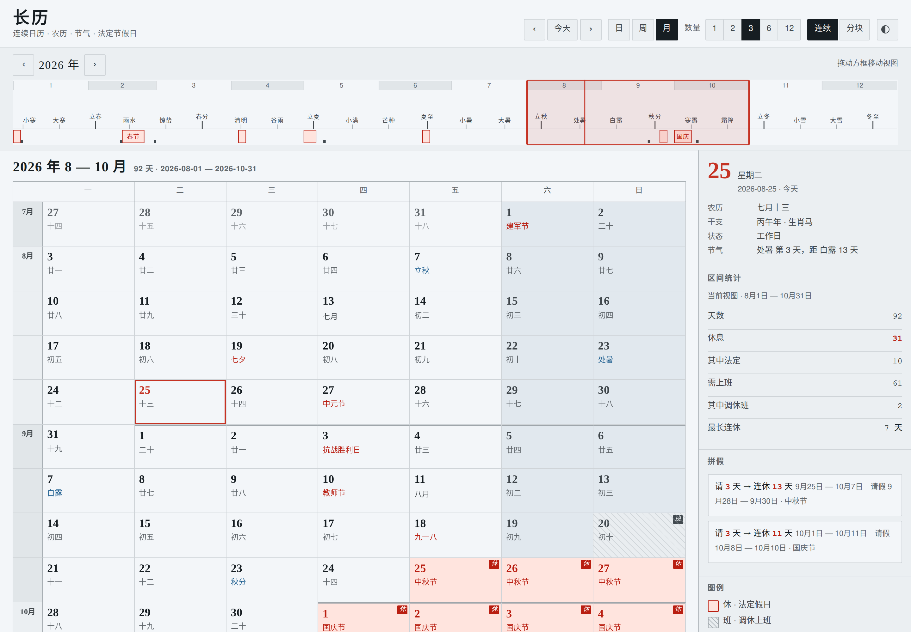

# 长历 changli

A continuous Chinese calendar. Months, weeks and days in **one uninterrupted
run** -- because planning a quarter means seeing a quarter, and every calendar
that shows you one month at a time makes you hold the other two in your head.

## What it does

- **Continuous multi-unit views.** 1-14 days, 1-8 weeks, or 1-12 months. In
  月 view the grid never breaks: 8/31 and 9/1 sit side by side, months divided
  by a rule and a gutter label rather than by a gap. `分块` gives you the
  familiar month cards if you want them.
- **Statutory 休 / 班.** Chinese public holidays and the 调休 make-up workdays,
  from the State Council's annual notice. Each year links to its gov.cn document.
- **拼假.** The thing a Chinese calendar should do and none of them do: select a
  span, or read the panel, and it tells you *请 3 天 → 连休 13 天* with the exact
  days to book.
- **农历, 节气, 干支, 生肖** on every day, computed from a real ephemeris.
- Fixed **UTC+8**, wherever the browser is. Light and dark. Full keyboard.
  Works offline; no build step, no dependencies, no network at runtime.

## Run it

Any static server:

    python3 -m http.server 8811
    # open http://localhost:8811

## Accuracy

Two different kinds of truth, kept apart on purpose.

**Astronomy is computed.** Lunar months begin at the new moon and 节气 fall at
15-degree steps of solar longitude, both reduced to the civil date in UTC+8 --
which is what GB/T 33661-2017 says the 农历 actually is. `src/ephemeris.js` is
generated from **JPL DE440s** for 1900-2100; `src/astro.js` implements Meeus
directly and covers everything outside that range.

    node test/verify.js

394 anchors: published 春节 dates 1990-2035, published leap months (including
2033's 闰冬月, the case that breaks table-driven implementations), a 30-year
day-by-day walk, and the knife-edge boundaries that land within seconds of
midnight in Beijing. Cross-checked day-for-day against an independent
implementation across 1970-2070: **0 differences in 36,890 days and 2,424
solar terms.**

**Holidays are policy.** They are announced each year and are not derivable.
`src/holidays.js` covers 2015-2026. A year whose notice has not been published
says so and refuses to compute 拼假 rather than guessing.

    node test/gen-holidays.mjs          # refresh from the published notices
    python3 test/gen-ephemeris.py       # regenerate the ephemeris (needs skyfield)

## Layout

    index.html          the surface; the design promise is its first comment
    assets/tokens.css   the only place colour is allowed to exist
    assets/app.css      the surface styles
    src/astro.js        Meeus: solar longitude, new moons, delta-T, the 农历 rules
    src/ephemeris.js    GENERATED: JPL boundaries, 1900-2100, ~7 KB
    src/holidays.js     GENERATED: the State Council notices, 2015-2026
    src/calendar.js     day records, the status program, 拼假 arithmetic
    src/ui.js           views, selection, the ribbon
    DESIGN.md           the material contract -- read before touching the UI
    TASTE.md            rulings, with their reasons

## Credits

Holiday data transcribed by [NateScarlet/holiday-cn](https://github.com/NateScarlet/holiday-cn)
from 国务院办公厅 notices. Ephemeris: JPL DE440s via [Skyfield](https://rhodesmill.org/skyfield/).
Algorithms: Jean Meeus, *Astronomical Algorithms*, 2nd ed.
